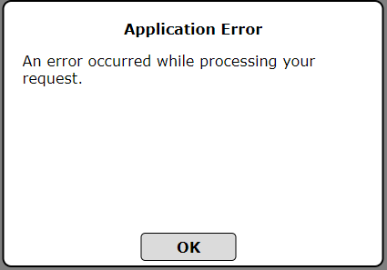
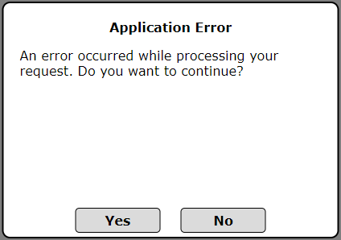

# spDialog by Simple Potential
spDialog is designed to provide web developers a simple way to show a quick dialog message to the user.  The project aims to replace most instances of the out-of-the-box JS `Alert()` and `Confirm()` dialogs.

*__This document is a WIP__*

## Table of Contents
* [Installation](#installation)
* [General Usage](#general-usage)
* [Processing Results](#processing-results)
* [Parameters](#parameters)

## Installation
Simply download the JS file and add a reference to it in your HTML header

    

You should use `defer` to ensure it loads after the document has fully rendered for best results.

## General Usage
The spDialog class allows you to create a dialog box with very little code.  In its simplest form, you could alert the user to an error in the application using just a few lines:

    let params = {
        showAnswerFalse: false,
        textTitle: 'Application Error',
        textBody: 'An error occurred while processing your request.'
    }

    let dlg = new spDialog(params);
    dlg.ShowDialog();

This will produce a dialog that looks like this:

### Example explained:
At the most basic level you need to setup a parameters object which will hold all the options for the dialog.  See the [Parameters](#parameters) section for a detailed list.

You then initiate the new dialog and pass in the parameters object you created.  You could opt to create the dialog and leave it in waiting and not call `ShowDialog()` until you are ready to display it.

`showAnswerFalse: false` tells the dialog that you only want to see a single button for the user to click.  Since we didn't specify `textAnswerTrue` in the parameters, the button text will default to **OK**.  If we were displaying the False button, the default text for the True button would be **Yes** and the False would be **No**.

Technically the `textTitle` and `textBody` could be removed if you wanted to show a blank dialog.

*Using the above example, you'll display the dialog and code execution will continue while it is displayed.  There are ways around this in the next section.*

### Great, but I need to ask the user a question?

If you wanted to display a question for the user to answer, you'd simply change `showAnswerFalse` to **true** and you would probably want to update the `textBody`:

    let params = {
        showAnswerFalse: true,
        textTitle: 'Application Error',
        textBody: 'An error occurred while processing your request.  Do you want to continue?'
    }

    let dlg = new spDialog(params);
    dlg.ShowDialog();

This will produce a dialog that looks like this:

Note that you can create as many dialogs as you like or you could simply adjust the [parameters](#parameters) each time to reduce the size of your application.  Let us assume you created `dlg` in the last example already and you now want to update the dialog so it shows a Cancel button:

    dlg.showAnswerCancel = true;
    dlg.Init();
    dlg.ShowDialog();

This will adjust the settings of the dialog to show the Cancel button, reinitialize the dialog (which will destroy the HTML previously created and recreate it), then shows the dialog.  You can do this with any or all of the [parameters](#parameters).

## Processing Results

A promise is returned when the user makes a selection.  You can access the user's response using the `userResponse` property.  It will either be **1**, **0**, or **-1**.  **1** indicates the user clicked the `answerTrue` button, **0** the `answerFalse` button, and **-1** indicates they clicked `answerCancel`.

When the dialog closes, it will call the `onClose` callback if provided (see previous example).  It will pass in a *result* parameter which uses the same values present in `userResponse`.

Lets look at another example.  This time, we'll use the promise approach:

    let params = {
        showAnswerFalse: true,
        textTitle: 'Make A Selection',
        textBody: 'Do you want to continue?'
    }

    let dlg = new spDialog(params);

    dlg.Init();
    dlg.ShowDialog().then((result) => {
        console.log(`User Picked ${dlg.userResponse}`)
    });

    console.log('DONE');

In this example, we're creating the dialog and processing a console output stating what the user picked after they make their selection.  It also logs to the console *DONE*, but you'll notice that *DONE* prints to the console before the user makes their selection.  This may be fine for your needs but if you need to wait, we can use `async` and `await`.  Here is an example:

    async function ShowMsg()
    {
        let params = {
            showAnswerFalse: true,
            textTitle: 'Make A Selection',
            textBody: 'Do you want to continue?'
        }

        let dlg = new spDialog(params);

        dlg.Init();
        await dlg.ShowDialog().then((result) => {
            console.log(`User Picked ${dlg.userResponse}`)
        });

        console.log('DONE');
    }

Now when you call `ShowMsg()` you'll see that nothing is printed to the console until the user has made a selection.  Use which ever method best fits your needs.

## Parameters
These are all the parameters available to you when want to create a dialog.

| Parameter              	| Default     	| Description                                                                                                                                                                                                                                                  	|
|------------------------	|-------------	|--------------------------------------------------------------------------------------------------------------------------------------------------------------------------------------------------------------------------------------------------------------	|
| textTitle              	| *blank*     	| Text to display at top of the dialog box                                                                                                                                                                                                                     	|
| textBody               	| *various*   	| The primary text to display to the user.                                                                                                                                                                                                                     	|
| customBody             	| *null*      	| When provided, *textBody* is ignored. You can use this to provide your own custom content in the dialog.  Setup a `DIV` in your body, set its display property to `none`. When setting up your dialog, set customBody: document.getElementById('myDivBlock') 	|
| showAnswerFalse        	| *false*     	| Tells dialog whether or not to show the False button.                                                                                                                                                                                                        	|
| showAnswerCancel       	| *false*     	| Tells dialog whether or not to show the Cancel button.                                                                                                                                                                                                       	|
| textAnswerTrue         	| *various*   	| Text to display on the True button.  When `showAnswerFalse` is *false*, defaults to **OK** and when *true* defaults to **Yes**                                                                                                                               	|
| textAnswerFalse        	| *No*        	| Text to display on the False button.                                                                                                                                                                                                                         	|
| textAnswerCancel       	| *Cancel*    	| Text to display on the Cancel button.                                                                                                                                                                                                                        	|
| onClose                	| *undefined* 	| Use to specify a function to call when the dialog closes.  A single parameter will be passed in containing the `userResponse`                                                                                                                                	|
| onOpen                 	| *undefined* 	| Use to specify a function to call when the dialog opens.  No parameters are passed.                                                                                                                                                                          	|
| dialogWidth            	| *375px*     	| Width of the dialog box                                                                                                                                                                                                                                      	|
| dialogHeight           	| *250px*     	| Height of the dialog box                                                                                                                                                                                                                                     	|
| dialogFont             	| *Verdana*   	| Font for all text in the dialog box                                                                                                                                                                                                                          	|
| dialogFontSize         	| *1rem*      	| Size of font for all text in the dialog box                                                                                                                                                                                                                  	|
| dialogSquareCorners    	| *false*     	| *false* to have slightly rounded corners, *true* to have right angle corners                                                                                                                                                                                 	|
| dialogNoAnimate        	| *false*     	| When *false*, dialog fades in/out.                                                                                                                                                                                                                           	|
| dialogAnimateTime      	| *.25*       	| Amount of time to spend fading the dialog in seconds                                                                                                                                                                                                         	|
| weightAnswer           	| *bold*      	| The font weight for the answer buttons                                                                                                                                                                                                                       	|
| zIndex                 	| *7000000*   	| The Z Index you wish to display the dialog at.                                                                                                                                                                                                               	|
| colorAnswerTrue        	| *#dbdbdb*   	| The color of the True button                                                                                                                                                                                                                                 	|
| colorAnswerFalse       	| *#dbdbdb*   	| The color of the False button                                                                                                                                                                                                                                	|
| colorAnswerCancel      	| *#dbdbdb*   	| The color of the Cancel button                                                                                                                                                                                                                               	|
| colorAnswerHoverTrue   	| *#d0d0d0*   	| The color of the True button when hovered                                                                                                                                                                                                                    	|
| colorAnswerHoverFalse  	| *#d0d0d0*   	| The color of the False button when hovered                                                                                                                                                                                                                   	|
| colorAnswerHoverCancel 	| *#d0d0d0*   	| The color of the Cancel button when hovered                                                                                                                                                                                                                  	|

### Other References
You can also access the following:

| Name          	| Description                                                                                                        	|
|---------------	|--------------------------------------------------------------------------------------------------------------------	|
| userResponse  	| The last selected response from the user.  Will be 1 for True Button; 0 for False Button; and -1 for Cancel Button 	|
| modalCover    	| A reference to the modal DIV background cover.                                                                     	|
| modalDialog   	| A reference to the main dialog DIV                                                                                 	|
| dialogTitle   	| A reference to the dialog Title DIV                                                                                	|
| dialogBody    	| A reference to the dialog Body DIV                                                                                 	|
| answerWrapper 	| A reference to the answer button's parent DIV                                                                      	|
| answerTrue    	| A reference to the True button                                                                                     	|
| answerFalse   	| A reference to the False button                                                                                    	|
| answerCancel  	| A reference to the Cancel button                                                                                   	|
| dialogBuilt   	| While technically for internal use, this will tell you when the dialog has been built                             	|
| GetVersion()   	| Get the version number of spDialog that is currently in use                            	|